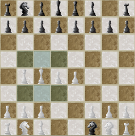
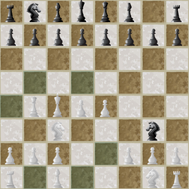
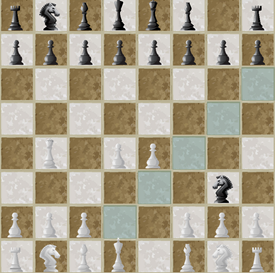
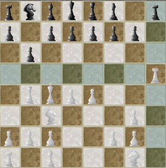
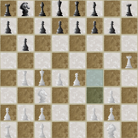

# Chess project
## Introduction
Chess is a two-player game developed sometime in 7th century. This game is a board with 8 squares on each side. Each player has 16 pieces to play with. There are 8 pawns, 2 rooks, 2 bishops, 1 queen and a king for each player. Each type piece has its own value and has limited number of squares it can travel to from its current position.
The objective of the game is to capture the other player’s king. This happens when the king cannot move into a safe square. In essence the king’s adjacent blocks are not safe. When a player captures the king, the player is declared the winner of the game, but there can be a state in which the player does not win. This sate is called stale mate, this state takes place when the pieces of either side cannot move to a new place.
The movement on the chess board has some fundamental rules. A piece cannot attack its own team’s piece. Each square can hold at max one piece.
The pieces can move as follows:
- King: can move to all adjacent blocks if the adjacent blocks are not attacked by enemy pieces.
- Queen: can move all available piece in the same row, in the same column and the adjacent pieces to the queen.
- Bishop: A bishop can only move diagonally.
- Horse: can move in an L shape form the current location. It can jump over other pieces.
- Rook: can only move in same row or in same column.
- Pawn: On the first move the pawn can move two positions, on the first move the pawn can move only by one position. It can also only attack diagonally.

Special moves that can take place are en peasant, castling and piece promotion.

## Visualization of the possible moves

| King                         | Queen                         | Horse                         |
|------------------------------|-------------------------------|-------------------------------|
|  |  |  |

| Bishop                         | Rook                         | Pawn                         |
|--------------------------------|------------------------------|------------------------------|
|  |  |  |

## Usage guidelines

- To run the assignment, execute the main.java file.
- The user will get a main screen.
- To play the game click on single player.
- To quit, press quit. 
- On the pressing the single player button user will be requested to provide the name and the depth
parameter the user wants. 
- After pressing the play button, the board is loaded and the game starts.
- To move a piece, click on it.
- The possible locations that the piece can move to will be highlighted on the board.
- Click on the board to move the piece to the location.
- If there is an enemy piece on the location then click on the board not the piece.

## Chess Engine

- The system has two parts front end (Gui) and the back end.
- The information of  the board is stored in the backgroundData class in a 2d-array of Piece class. 
- A piece in is an abstract class which holds the basic information of a piece,
  - It’s position.
  - The image of the piece.
  - Type of the piece.
  - List of highlighted squares.
  - Set of possible positions the piece can go to.
  - It’s power to specifically identify what piece it is
  - Number of moves and another position set which is used when the king is in check state.
- A piece is responsible for calculating the possible moves it can do on a given board, 
- The Gui uses those calculated moves to highlight the possible squares on the grid to show the player the possible moves when clicked o.
- Also, servers as an internal validation function to check if the calculated possible position of a piece is correct or not.
- A position is incorrect if there is a friendly player there or the position falls out of the board.

## Implementation of Chess Pieces

### King
- The king can move to adjacent squares hence for a given position i,j the
  isValid function is called to validate all possible adjacent squares.
- Additionally, the system checks if the king moving to the new location can cause a check.
- If so, the location is rejected. 
- Each new possible location is added to a set of Position object and returned after all hypothetically possible
locations have been tried.
- All other pieces also store a saving positions set.
- When the king of the same type is in check the getPossiblePositions returns the possible positions that the piece 
can move to stop the check by either blocking the path or by killing the attacking piece.

### Queen
- It can move in either row or column, diagonally and in adjacent pieces.
- It is a combination of the algorithm for [King](#king), [Bishop](#bishop) and [Rook](#rook).
- A hashset of position object storing positions from (0,0) to (7,7) in format of ((i*8)+j) 
was used to calculate check mate faster.

### Bishop
- It can move diagonally, the iterations of possible moves can be (i-1, j-1) till i>0 and j>0, (i+1, j+1) till i<8 and j<8 and similarly (i-1, j+1) (i+1, j-1).
- A while loop is ran till either the hypothetical location has gone off the map or it has reached a piece on the board.

### Horse
- It can move in L directions. i.e. (i+2, j-1), (i+2, j+1), (i-1, j+2) (i+1, j+2), (i-2, j1), (i-2, j+1), (i-1, j-2) (i+1, j-2).
- All these locations are tested and valid positions are used.

### Rook
- It can move only in same row or in same column. i.e. (i, j-1), (i, j+1), (i+1, j), (i-1, j).
- A while loop is ran in all four directions till it is valid (it has not reached a piece or end of the board).

### Pawn
- A pawn can move forward on the first move.
- it can only attack in diagonal positions. 
- Hence, the number of moves variable is used to check if the pawn can move two places.
- Additionally, the pawn can be promoted if the location of white pawn is 0, j on the board or black at 7, j. 
This condition is checked in the backgroundData class method move.

### Gui 
- When the board is initialized each piece has an image.
- The image’s onclicked event is modified. So, when the user clicks the piece the function highlights
possible positions for that piece. 
- The highlighted squares are colored blue. 
- Each highlighted square holds the blue image. 
- The image’s on click event calls the move method of the backgroundData class to move the appropriate piece to the
square.
- When the user clicks on the piece the previous highlights stored in the currentlyHighlighted object are cleared.

### Moving a Piece
- The movePiece method handles moving a piece on the board.
- It is sent previous i,j , new i,j and the piece to be moved.
- It checks if the piece getting attacked is king if so, the method ends the game.
- Else it checks if move is a promotion move.
- During a promotion move the user is presented with a dialog box.
- When the user closes the dialog box pawn is replaced with new piece that was selected.
- If in the 2-d array the new location is null (i.e., empty) the piece is moved and previous location becomes null.
- If there is an enemy piece on the new location, then the gui kill method is called to move the piece to the side of the
table and the array is updated, highlights are cleared and moves of the piece are
updated.
- Then the player type is changed, true represents user false ai.
- If the ai is on i.e., isAiPlaying = true in the backgroundData class.
- A new task is created passing the values for the heuristic and depth to the cpu class.
- On completion of the task movePiece method is called to move the best decided piece by the ai.

## Game-Over States

### Checkmate 
- A hash table of Piece and set positions is used to keep count of the piece attacking the king.
- For every enemy piece in the board.
  - If the piece can attack the king.
  - Its attack path is calculated.
  - If attack is diagonal the difference between i values and j values will be the same.
  - If the attack is horizontal/ vertical the one of the i/j values difference will be 0.
  - Then a  possible attack path is calculated and the piece is added to the attack hash table.
- For every friendly piece on the board.
  - If the piece’s possible position set contain any of the positions of the attacker.
  - Then the attacker can be blocked or killed hence the attacking is added to another set of pieces.
- At the end of the evaluation if the attacking table’s size > the set of pieces attacked by friendly pieces then it is a check-mate.
  
### Stalemate
- The total possible moves are evaluated while the system is checking for checkmate.
- If the total possible moves of the whole board is 0 then it is a stalemate.
- If node of the conditions satisfies then the checked king can be saved and the pieces which can save the king.
Have their relative saving positions stored in the Piece object. Such that when the piece is called. 
The background class’s relative check type can be observed and if the piece’s king is checked then 
only the possible saving positions are returned.

### AI
- The heuristic function used in the alpha beta.
- Is the (total number of moves possible * mobility rate) + appropriateRates*(num of friendlies - num of opponents) + (num
of pawns blocked) * rate. 
- The evaluation technique used is material evaluation + pawn location evaluation and mobility evaluation.
- [Material](https://www.chessprogramming.org/Mobility) evaluation: 
  - It is the total sum of the piece values on each side.
  - Friendly pieces * appropriate piece rate.
  - For AI is calculated by sum of
    - ' : enemy type 
    - piece type weight *(num of piece type - num of piece type')
    - it is calculated for all peaces.
- [Mobility](https://www.chessprogramming.org/Material) evaluation: 
  - Number of legal moves that can be performed.
  - (num of totalMoves - num of totalMoves') * mobilityRate
-------
- The chess program was made in IntelliJ. The main package is called sample stored in the src folder.
- To run test on the engine please change the isAiPlaying to false in the backgroundData.java class on line 35.
- That way you can control both sides. Additionally, in the single player class Places pieces can be used to test individual pieces.
